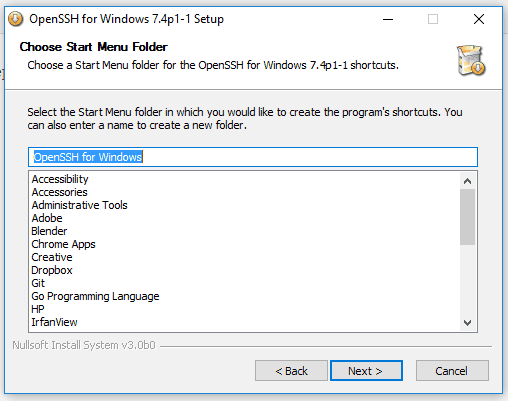

# Steps to install Open SSH manually on windows

## Download

From the project [website](http://www.mls-software.com/opensshd.html), download the latest binary.

## Install


On the **Welcome** screen click **Next>** to continue.


On the **Licence Agreement** screen select **"I accept the terms of the Licence Agreement"** and click **Next>** to continue.


On the **Choose Components** screen click, **Next>** to continue (there are already all selected).


On the **Choose Install Location** screen click, **Next>** to continue. (Changed the **Destination Folder** if needed)


On the **Choose Start Menu Folder** screen click, **Next>** to continue.



On the **Choose account under which to execute SSHD** screen click, **Next>** to continue.


On the **Choose SSHD priviledge seperation**, **Next>** to continue.


On the **Choose port for SSHD daemon** screen click, **Next>** to continue.


On the **Choose key size for key generation** screen click, **Next>** to continue.


On the **Choose user type for SSHD screen** click, **Next>** to continue.


On the **Finish** screen click, **Next>** to continue.


**Note:** the print screens are from Windows 10, but can be install on any Windows version.

**Note:** You will be given a generated password.  Be sure to write that down.

## Verify

Open the Command Prompt window and run the **ssh** command. If the output is similar to the following, you have successfully installed **openSSH** on your **Windows** machine.

```shell
C:\Users\adm>ssh

usage: ssh [-1246AaCfGgKkMNnqsTtVvXxYy] [-b bind_address] [-c cipher_spec]
           [-D [bind_address:]port] [-E log_file] [-e escape_char]
           [-F configfile] [-I pkcs11] [-i identity_file]
           [-J [user@]host[:port]] [-L address] [-l login_name] [-m mac_spec]
           [-O ctl_cmd] [-o option] [-p port] [-Q query_option] [-R address]
           [-S ctl_path] [-W host:port] [-w local_tun[:remote_tun]]
           [user@]hostname [command]

C:\Users\adm>
```


## Log into SSH using your local windows machine account user name and password

You may have to reboot

## Get into cygwin prompt after logging into ssh

```shell
cd c:\tools\cygwin
Cygwin.bat
```
